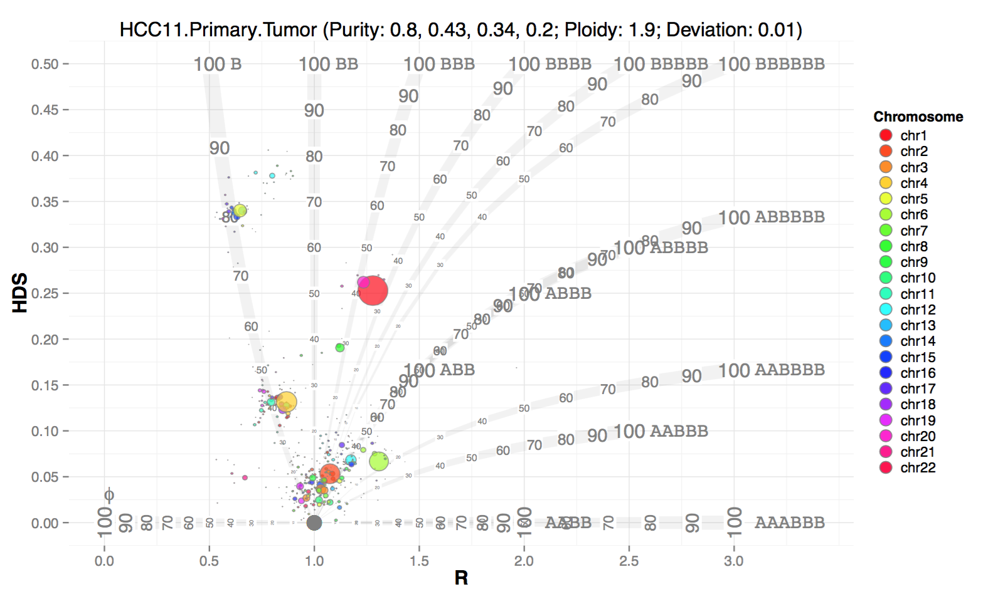

```{r style, echo = FALSE, results = 'asis'}
BiocStyle::markdown()
```

# Introduction

To evaluate the aneuploidy and prevalence of clonal or quasiclonal tumors, we developed a novel tool to characterize the mosaic tumor genome on the basis of one major assumption: the genome of a heterogeneous multi-cell tumor biopsy can be sliced into a chain of segments that are characterized by homogeneous somatic copy number alternations (SCNAs) and B allele frequencies (BAFs). The model, termed BubbleTree, utilizes both SCNAs and the interconnected BAFs as markers of tumor clones to extract tumor clonality estimates. BubbleTree is an intuitive and powerful approach to jointly identify ASCN, tumor purity and (sub)clonality, which aims to improve upon current methods to characterize the tumor karyotypes and ultimately better inform cancer diagnosis, prognosis and treatment decisions.

# Quickstart to Using BubbleTree

To perform a BubbleTree analysis, data pertaining to the position and B allele frequency of heterozygous snps in the tumor sample and segmented copy number information including the position, number of markers/segment and log2 copy number ratio between tumor and normal samples must first be obtained. 

## Preparing Data for BubbleTree

BubbleTree was developed using both whole exome sequencing (WES) and whole genome sequening (WGS) NGS data from paired tumor/normal biopsies, but this model should also be applicable to array comparative genomic hybridization (aCGH) and single nucleotide polymorphism (SNP) array data.

There are many methods for generating and processing sequencing data in preparation for BubbleTree analysis. In the following section we provide example workflows starting from WES NGS which can be adapted as needed to alternate inputs.

## Preparing Sequence Variation Data

The primary BubbleTree requirement for sequence variant information is a `r Biocpkg("GRanges")` object containing the B alelle frequencies and genomic positions of variants known to be heterozygous in the paired normal sample.

Mapped reads from tumor and normal tissue can be processed with mutation caller software such as VarScan or MUTECT. In this example, we use a hypothetical vcf file from VarScan output which contains mutation calls from both normal and tumor samples.


### Preparing BAF Data From VarScan

Assume that you have loaded the data snp.dat like this:

```{r eval=FALSE}
head(snp.dat)

  CHROM    POS  ID REF ALT QUAL FILTER LT.rna.dp LN.rna.dp ON.rna.dp OT.rna.dp BT.wes.dp LT.wes.dp LN.wes.dp ON.wes.dp
1  chr1  54757 rs202000650   T   G    .   PASS        NA        NA        NA        NA        NA        NA        NA        NA
2  chr1 564636           .   C   T    .   PASS        NA        NA        NA        NA        NA        NA        NA        NA
3  chr1 564862   rs1988726   T   C    .   PASS        NA        NA        NA        NA        NA        NA        NA        NA
4  chr1 564868   rs1832728   T   C    .   PASS        NA        NA        NA        NA        NA        NA        NA        NA
5  chr1 565454   rs7349151   T   C    .   PASS        NA        NA        NA        NA        NA        NA        NA        NA
6  chr1 565464   rs6594030   T   C    .   PASS        NA        NA        NA        NA        NA        NA        NA        NA
  OT.wes.dp LT.wgs.dp LN.wgs.dp ON.wgs.dp OT.wgs.dp LT.rna.freq LN.rna.freq ON.rna.freq OT.rna.freq BT.wes.freq LT.wes.freq
1        NA        25        24        27        19          NA          NA          NA          NA          NA          NA
2        NA        21        NA        NA        14          NA          NA          NA          NA          NA          NA
3        NA        10        15        55        13          NA          NA          NA          NA          NA          NA
4        NA        10        12        60        14          NA          NA          NA          NA          NA          NA
5        NA        21        14        26        24          NA          NA          NA          NA          NA          NA
6        NA        25        16        33        29          NA          NA          NA          NA          NA          NA
  LN.wes.freq ON.wes.freq OT.wes.freq LT.wgs.freq LN.wgs.freq ON.wgs.freq OT.wgs.freq
1          NA          NA          NA      0.2400      0.1667      0.2222      0.3684
2          NA          NA          NA      0.0000          NA          NA      0.1429
3          NA          NA          NA      0.4000      0.5333      0.9091      0.7692
4          NA          NA          NA      0.5000      0.6667      0.9333      0.7857
5          NA          NA          NA      0.1429      0.3571      0.6538      0.6250
6          NA          NA          NA      0.2000      0.3750      0.7273      0.5862

```


Identify the germline heterozygous loci:

```{rr}
is.hetero <- function(x, a=0.3, b=0.7) {
 (x - a)  *  (b - x) >= 0
}

wgs.snp.ss <- subset(snp.dat, ! CHROM %in% c("chrX", "chrY") & 
                         LN.wgs.dp >= 15 & 
                         ON.wgs.dp >=15 & 
                         is.hetero(LN.wgs.freq, 0.4, 0.6) & 
                         is.hetero(ON.wgs.freq, 0.4, 0.6))
```

Then convert to the GRanges object:

```{rr}
library(GenomicRanges)
wgs.hetero.grs <- list()
wgs.hetero.grs$lung <- with(wgs.snp.ss, GRanges(CHROM, IRanges(POS, POS), mcols=cbind(LT.wgs.dp, LT.wgs.freq)))
wgs.hetero.grs$ovary <- with(wgs.snp.ss, GRanges(CHROM, IRanges(POS, POS), mcols=cbind(OT.wgs.dp, OT.wgs.freq)))
names(elementMetadata(wgs.hetero.grs$lung)) <- names(elementMetadata(wgs.hetero.grs$ovary))  <- c("dp", "freq")
```

The B-allele frequency data is extracted using the Bioconductor package `r Biocpkg("VariantAnnotation")` and converted from string to numeric format.

### Preparing CNV Data from DNAcopy

The object seg is the segment call output from DNAcopy and min.num here specifies the minimum segment size to keep

```{rr}
library(GenomicRanges)
min.num <- 10
cnv.gr <- with(subset(seg$output, num.mark >= min.num & ! chrom %in% c("chrX", "chrY")) , GRanges(chrom, IRanges(loc.start, loc.end), mcols=cbind(num.mark, seg.mean)))
```

Then merge the SNP and CNV GRanges objects.

Example data in the desired format is provided as part of this package as GRanges objects and can be loaded as shown below. To utilize this vignette, you must first load BubbleTree below. You don't need to use "suppressMessages".

```{r}
suppressMessages(
    library(BubbleTree)
)
```

allCall.lst is pre-calculated CNV data. allRBD.lst is simply the RBD data from below.

```{r}
load(system.file("data", "allCall.lst.RData", package="BubbleTree"))
head(allCall.lst[[1]]@rbd)
```

However, if you wish to create your own RBD object from your input, you would use the code below. There is test data available in this package that is used for demonstration purposes.

```{r}
# load sample files
load(system.file("data", "cnv.gr.rda", package="BubbleTree"))
load(system.file("data", "snp.gr.rda", package="BubbleTree"))

# load annotations
load(system.file("data", "centromere.dat.rda", package="BubbleTree"))
load(system.file("data", "cyto.gr.rda", package="BubbleTree"))
load(system.file("data", "cancer.genes.minus2.rda", package="BubbleTree"))
load(system.file("data", "vol.genes.rda", package="BubbleTree"))
load(system.file("data", "gene.uni.clean.gr.rda", package="BubbleTree"))


# initialize RBD object
r <- new("RBD", unimodal.kurtosis=-0.1)

# create new RBD object with GenomicRanges objects for SNPs and CNVs
rbd <- makeRBD(r, snp.gr, cnv.gr)
head(rbd)

# create a new prediction
btreepredictor <- new("BTreePredictor", rbd=rbd, max.ploidy=6, prev.grid=seq(0.2,1, by=0.01))
pred <- btpredict(btreepredictor)

# create rbd plot
btreeplotter <- new("BTreePlotter", max.ploidy=5, max.size=10)
btree <- drawBTree(btreeplotter, pred@rbd)
print(btree)

# create rbd.adj plot
btreeplotter <- new("BTreePlotter", branch.col="gray50")
btree <- drawBTree(btreeplotter, pred@rbd.adj)
print(btree)

# create a combined plot with rbd and rbd.adj that shows the arrows indicating change
btreeplotter <- new("BTreePlotter", max.ploidy=5, max.size=10)
arrows <- trackBTree(btreeplotter,
                     pred@rbd,
                     pred@rbd.adj,
                     min.srcSize=0.01, 
                     min.trtSize=0.01)

btree <- drawBTree(btreeplotter, pred@rbd) + arrows 
print(btree)


# create a plot with overlays of significant genes
btreeplotter <- new("BTreePlotter", branch.col="gray50")
annotator <- new("Annotate")

comm <- btcompare(vol.genes, cancer.genes.minus2)

sample.name <- "22_cnv_snv"

btree <- drawBTree(btreeplotter, pred@rbd.adj) + 
    ggplot2::labs(title=sprintf("%s (%s)", sample.name, info(pred)))

out <- pred@result$dist  %>% 
    filter(seg.size >= 0.1 ) %>% 
    arrange(gtools::mixedorder(as.character(seqnames)), start)

ann <- with(out, {
    annoByGenesAndCyto(annotator,
                       as.character(out$seqnames),
                       as.numeric(out$start),
                       as.numeric(out$end),
                       comm$comm,
                       gene.uni.clean.gr=gene.uni.clean.gr,
                       cyto.gr=cyto.gr)
})

out$cyto <- ann$cyto
out$genes <- ann$ann

btree <- btree + drawFeatures(btreeplotter, out)
print(btree)


# print out purity and ploidy values
info <- info(pred)
cat("\nPurity/Ploidy: ", info, "\n")
```

The remaining datasets used to support the CNV data display on the BubbleTree plots.

```{r}
load(system.file("data", "cancer.genes.minus2.rda", package="BubbleTree")) 
load(system.file("data", "vol.genes.rda", package="BubbleTree"))
load(system.file("data", "gene.uni.clean.gr.rda", package="BubbleTree"))
load(system.file("data", "cyto.gr.rda", package="BubbleTree")) 
load(system.file("data", "centromere.dat.rda", package="BubbleTree")) 
load(system.file("data", "all.somatic.lst.RData", package="BubbleTree"))
load(system.file("data", "allHetero.lst.RData", package="BubbleTree")) 
load(system.file("data", "allCNV.lst.RData", package="BubbleTree")) 
load(system.file("data", "hg19.seqinfo.rda", package="BubbleTree")) 
```

```{r}
# lists of 379 known cancer genes
head(cancer.genes.minus2)
# another list of 105 known cancer genes
head(vol.genes)

# full gene annotation Grange object
head(gene.uni.clean.gr)

# cytoband coordinate data
head(cyto.gr)

# centromere coordinate data
head(centromere.dat)

# SNV location data
head(all.somatic.lst, n=1L)

# sequence variants
head(allHetero.lst, n=1L)

# copy number variation data
head(allCNV.lst, n=1L)

# hg19 sequence data
hg19.seqinfo
```

# Main Bubbletree Functions

## BubbleTree model and diagram
BubbleTree is a model based on three valid assumptions: 1) the paired normal specimen expresses the common diploid state, 2) variant sites are bi-allelic, and 3) genome segments (rather than the whole genome) with homogeneous copy number ratio and BAFs, exist in the profiled tumor genome. The first two assumptions generally hold, whereas the last homogeneity assumption can also be satisfied even in the case of a complex tumor clonal structure.

As the three assumptions are all generally plausible, we therefore developed a model for the BubbleTree diagram. For one homogenous genomic segment (x:y;p), we have,

Expected copy number, (CN)=2×(1-p)+(x+y)×p

Copy Ratio, R=(CN)/2=(1-p)+(x+y)/2×p (1)

B allele frequency, BAF=(y×p+1×(1-p))/((x+y)×p+2×(1-p))

and the homozygous-deviation score (HDS),

HDS= ∣BAF-0.5∣=(p×∣y-x∣)/(2×[(x+y)×p+2×(1-p)]) (2)

Based on equations (1) and (2), we are able to calculate an R score (copy ratio) and HDS for a segment (x:y; p). For example, (0:1; 0.75) will provide 0.625 and 0.3 for the R scores and HDS, respectively.


## Description of the BubblePlot Graph

### The Branches

```{r}
btreeplotter <- new("BTreePlotter", max.ploidy=5, max.size=10)
print(btreeplotter@branches)
```

The below plot introduces the relationship between HDS and R score (copy number ratio), both used to elucidate the tumor cell prevalence, ploidy state, and clonality for a tumor sample. Generally, the R score indicates the copy number change, ranging from 0 (homozygous deletion) to 3 (hexaploidy) or higher, while the HDS represents LOH, ranging from values of 0 to 0.5 (i.e., LOH with 100% prevalence). Each branch in the diagram starts at the root (1,0), a value of HDS=0 and R score=1. Namely, a diploid heterozygous genotype segment has a copy number ratio, or R score of 1 (tumor DNA copies=2; normal DNA copies=2, so 2/2=1) with no LOH (HDS=0) and is indicated with a genotype of AB, where the A allele is from one parent and the B allele is from the other parent presumably. Then from the root (1,0), the segment prevalence values are provided in increasing increments of 10%, with each branch representing a different ploidy state. As the values increase along the y-axis, the occurrence of LOH increases, such that on the AA/BB branch at HDS=0.5 and R score=1, this indicates a disomy state with LOH and 100% prevalence for the segment.

<div style="text-align: center; font-weight: bold;">
BubbleTree plots for Primary Liver Tumor

</div>
<br/>

Generally, the branches mark the projected positions of segments at the given integer copy number ploidy states and prevalence. The plot clearly highlights how high prevalence values create distinct separation between branches (i.e., ploidy states), while as prevalence approaches zero, the branches are non-distinguishable. The ploidy states of Φ, AABB, and AAABBB all have HDS scores of 0, which indicate no LOH at increasing or decreasing R scores from a value of 1, and therefore differ most from the copy number neutral heterozygous disomy state (AB) by R score only. These three ploidy states indicate homozygous deletion (Φ) or amplifications (AABB=1 DNA copy number gain each allele, AAABBB=2 DNA copy number gains each allele). Other ploidy states such as ABB (brown), ABBB (blue), ABBBB (green), or ABBBBB (purple) share a piece of the same branch (i.e., the indistinguishable branches), suggesting the existence of multiple likely combinations of prevalence and ploidy states for that region. A tumor clone usually has more than one SCNA, so the abundance of the clone can still be inferred from other distinguishable branches.

### The Bubbles

```{r}
load(system.file("data", "allCall.lst.RData", package="BubbleTree"))
btreeplotter <- new("BTreePlotter", max.ploidy=5, max.size=10)
sample <- allCall.lst[["sam10"]]
rbd1 <- sample@rbd
rbd2 <- sample@rbd.adj
arrows <- trackBTree(btreeplotter, rbd1, rbd2, min.srcSize=0.01, min.trtSize=0.01)
btree <- drawBTree(btreeplotter, rbd1)
print(btree)
```

Along with the branches from the prediction of the model, bubbles (i.e., the leaves) are depicted on the basis of the real data, where the size of the bubbles are proportional to the length of the homogenous segments. A bubble (i.e. the homogeneous SCNA segment) represents the HDS and R score as measured from the assay, such as WES or WGS data. The location of the bubble determines the allele copy number(s) and prevalence for the SCNA segment. A close proximity between a bubble and branch indicates an integer copy-number (e.g. 15q11.2-14), whereas any deviation between the bubble and branch (e.g, 7q21.11-21.12) is due to either variation in the measurement or a non-integer copy-number – something that occurs with multiple clones harboring different SCNAs over the same region.)


## BubbleTree plot for a WGS sample using adjusted and non-adjusted CNV data.

```{r}
load(system.file("data", "allCall.lst.RData", package="BubbleTree"))
btreeplotter <- new("BTreePlotter", max.ploidy=5, max.size=10)
sample <- allCall.lst[["sam12"]]
rbd1 <- sample@rbd
rbd2 <- sample@rbd.adj
arrows <- trackBTree(btreeplotter, rbd1, rbd2, min.srcSize=0.01, min.trtSize=0.01)
btree <- drawBTree(btreeplotter, rbd1) + drawBubbles(btreeplotter, rbd2, "gray80") + arrows
print(btree)
```

## BubbleTree plot for a WGS sample using only non-adjusted CNV data.

```{r}
load(system.file("data", "allCall.lst.RData", package="BubbleTree"))
btreeplotter <- new("BTreePlotter", max.ploidy=5, max.size=10)
sample <- allCall.lst[["sam12"]]
rbd1 <- sample@rbd
rbd2 <- sample@rbd.adj
arrows <- trackBTree(btreeplotter, rbd1, rbd2, min.srcSize=0.01, min.trtSize=0.01)
btree <- drawBTree(btreeplotter, rbd1) + arrows
print(btree)
```

## View data and generate Excel report

This report only shows samples that have tumors with high ploidy and high purity. 

```{r}
load(system.file("data", "allRBD.lst.RData", package="BubbleTree"))
btreepredictor <- new("BTreePredictor")
btreepredictor@config$cutree.h <- 0.15

high.ploidy <- rep(TRUE, length(allRBD.lst))
high.purity <- rep(TRUE, length(allRBD.lst))

high.ploidy[c("sam6",
              "ovary.wgs",
              "ovary.wes",
              "TCGA-06-0145-01A-01W-0224-08",
              "TCGA-13-1500-01A-01D-0472-01",
              "TCGA-AO-A0JJ-01A-11W-A071-09")] <- FALSE

high.purity[c("sam6", "ovary.wgs", "ovary.wes")] <- FALSE

nn <- "sam13"
rbd <- allRBD.lst[[nn]]
btreepredictor@config$high.ploidy <- high.ploidy[nn]
btreepredictor@config$high.purity <- high.purity[nn]
btreepredictor <- loadRBD(btreepredictor, rbd)
btreepredictor@config$min.segSize <- ifelse(max(btreepredictor@rbd$seg.size, na.rm=TRUE) < 0.4, 0.1, 0.4)
btreepredictor <- btpredict(btreepredictor)
```

## Tumor Purity
The purity, or prevalence of tumor cells within the tumor, can be determined from the SCNA segments at the highest HDS values, assuming the tumor cells all harbor some proportion of SCNAs or LOH.

```{r}
cat(info(btreepredictor), "\n")

names(allCall.lst) <- names(allRBD.lst)
results <- list()
for (name in names(allCall.lst)) {
    results[[name]] <- allCall.lst[[name]]@result$dist
}
```

Run this code to print out an Excel file of the same report
```
xls.filename <- paste("all_calls_report", "xlsx", sep=".")
saveXLS(results, xls.filename)

```

## BubbleTree plot with an overlay of 77 common cancer genes (black rectangles).

```{r}
load(system.file("data", "allCall.lst.RData", package="BubbleTree"))
load(system.file("data", "cancer.genes.minus2.rda", package="BubbleTree"))
load(system.file("data", "vol.genes.rda", package="BubbleTree"))
load(system.file("data", "gene.uni.clean.gr.rda", package="BubbleTree"))
load(system.file("data", "cyto.gr.rda", package="BubbleTree"))

# 77 common cancer genes merged from 2 sets
comm <- btcompare(vol.genes, cancer.genes.minus2)

btreeplotter <- new("BTreePlotter", branch.col="gray50")
annotator <- new("Annotate")

nn <- "sam13"
cc <- allCall.lst[[nn]]
z <- drawBTree(btreeplotter, cc@rbd.adj) + ggplot2::labs(title=sprintf("%s (%s)", nn, info(cc)))
out <- cc@result$dist  %>% filter(seg.size >= 0.1 ) %>% arrange(gtools::mixedorder(as.character(seqnames)), start)

ann <- with(out, {
    annoByGenesAndCyto(annotator,
                       as.character(out$seqnames),
                       as.numeric(out$start),
                       as.numeric(out$end),
                       comm$comm,
                       gene.uni.clean.gr=gene.uni.clean.gr,
                       cyto.gr=cyto.gr)
})

out$cyto <- ann$cyto
out$genes <- ann$ann
v <- z + drawFeatures(btreeplotter, out)
print(v)

```


## BAF and Heterozygosity Graph

BubbleTree can create a summary visualization that displays the concordance between copy number and max B-allele Frequency for each chromosome as well as compare the BAF and R scores.

```{r}
load(system.file("data", "allCall.lst.RData", package="BubbleTree"))
load(system.file("data", "centromere.dat.rda", package="BubbleTree"))
load(system.file("data", "all.somatic.lst.RData", package="BubbleTree"))
load(system.file("data", "allHetero.lst.RData", package="BubbleTree"))
load(system.file("data", "allCNV.lst.RData", package="BubbleTree"))
load(system.file("data", "hg19.seqinfo.rda", package="BubbleTree"))

trackplotter <- new("TrackPlotter")

nn <- "sam12"
ymax <- ifelse(nn %in% c("lung.wgs", "lung.wes"), 9, 4.3)

p1 <- xyTrack(trackplotter,
              result.dat=allCall.lst[[nn]]@result,
              gr2=centromere.dat,
              ymax=ymax) + ggplot2::labs(title=nn)

p2 <- bafTrack(trackplotter,
               result.dat=allCall.lst[[nn]]@result,
               gr2=centromere.dat,
               somatic.gr=all.somatic.lst[[nn]])

t1 <- getTracks(p1, p2)

z1 <- heteroLociTrack(trackplotter, 
                      allCall.lst[[nn]]@result, 
                      centromere.dat, 
                      allHetero.lst[[nn]])

z2 <- RscoreTrack(trackplotter, 
                  allCall.lst[[nn]]@result, 
                  centromere.dat, 
                  allCNV.lst[[nn]])

t2 <- getTracks(z1, z2)

gridExtra::grid.arrange(t1,t2, ncol=1)
```


## Perform a comparison of cancer datasets.

Show the SCNV changes between the recurrent tumor and the primary tumor.

```{r}
load(system.file("data", "allCall.lst.RData", package="BubbleTree"))
btp <- new("BTreePlotter", max.ploidy=5, max.size=10)

nn1 <- "HCC11.Primary.Tumor"
nn2 <- "HCC11.Recurrent.Tumor" 

rbd1 <- allCall.lst[[nn1]]@result$dist
rbd2 <- allCall.lst[[nn2]]@result$dist

srcSize <- 0.5
trtSize <- 1
minOver <- 1e7

arrows <- trackBTree(btp,
                     rbd1,
                     rbd2,
                     min.srcSize=srcSize,
                     min.trtSize=trtSize,
                     min.overlap=minOver)

z <- drawBTree(btp, rbd1)

if(!is.null(arrows)) {
    z <- z + arrows + ggplot2::labs(title=sprintf("%s -> %s", nn1, nn2))
}
print(z)

```

## To print out an Excel document of summary of the pre-called CNV data.

```
library(BubbleTree)
load(system.file("data", "allCall.lst.RData", package="BubbleTree"))

all.summary <- plyr::ldply(allCall.lst, function(.Object) {
    purity <- .Object@result$prev[1]
    adj <- .Object@result$ploidy.adj["adj"]
    ploidy <- (2*adj -2)/purity + 2  # when purity is low the calculation result is not reliable
    
    with(.Object@result,
         return(c(Purity=round(purity,3),
                  Prevalences=paste(round(prev,3), collapse=", "),
                  "Tumor ploidy"=round(ploidy,1))))
}) %>% plyr::rename(c(".id"="Sample"))

xls.filename <- paste("all_summary", "xlsx", sep=".")
saveXLS(list(Summary=all.summary), xls.filename)

```

# Citation

Zhu W, Kuziora M, Creasy T, Lai Z, Morehouse C, Guo X, Sebastian Y, Shen D, Huang J, Dry JR, Xue F, Jiang L, Yao Y, Higgs BW (2015). "BubbleTree: an intuitive visualization to elucidate tumoral aneuploidy and clonality using next generation sequencing data." Nucleic Acids Research.

